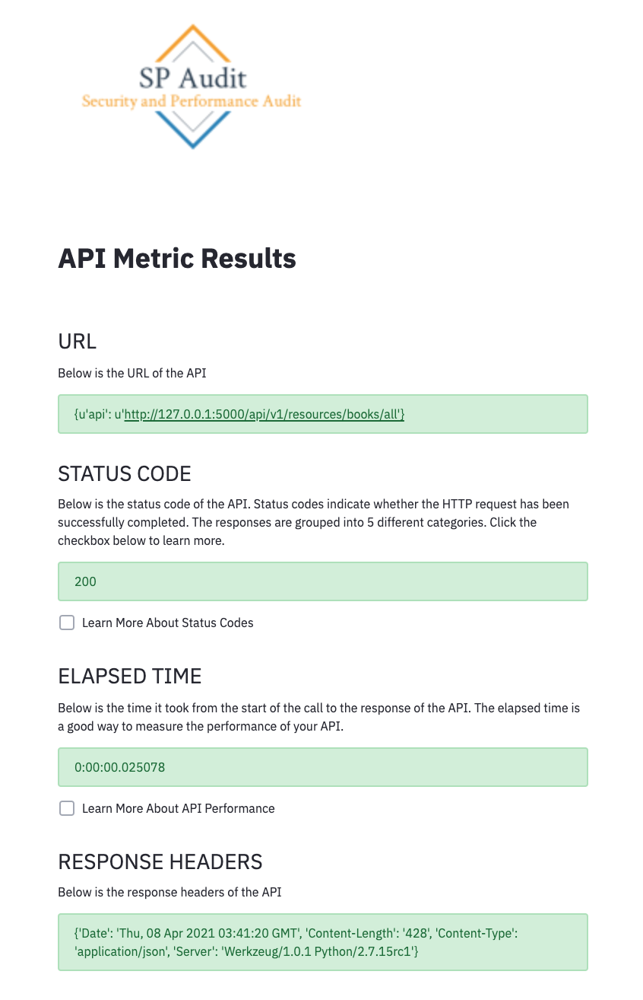
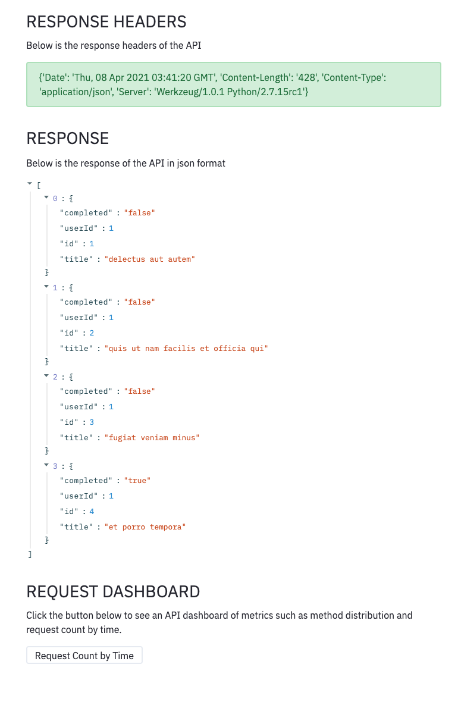
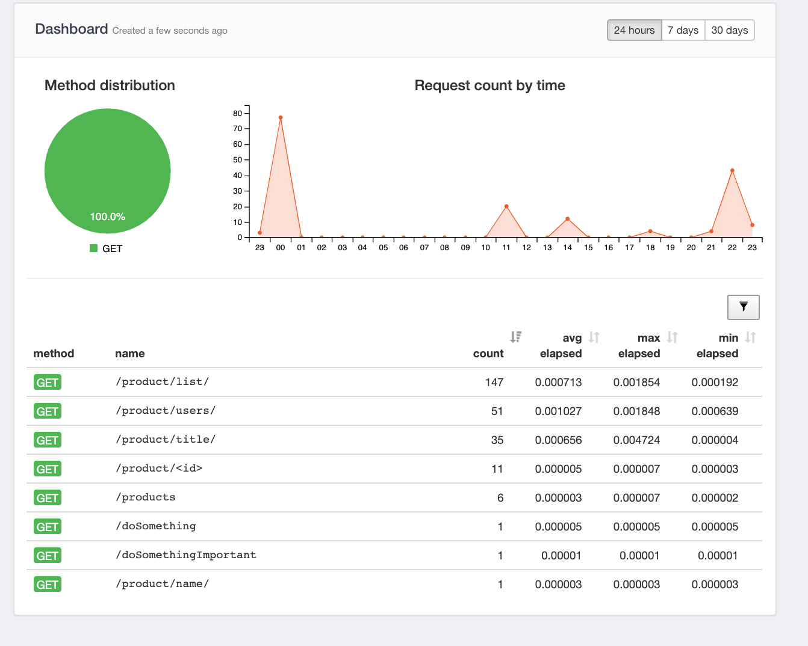

## **Security Performance Audit**
SP Audit is a user ran tool that helps develepers increase security and performance measures of an API.  The tool calculates metadata of the specified API and outputs metric results.

# Running the Tool
First, make sure the following are installed locally on your machine.
1. Python3
3. Requests
4. Streamlit
5. jmespath

Next, run the API that you would like to test in SP Audit.

Finally, navigate to the main directory (Security&Performance Audit) and run `streamlit run PerformanceAudit.py`.

# Testing the Tool
To test SP Audit, run the command `pytest tests` to test using Pytest.

# SP Audit Interface

# Flask Dashboard

